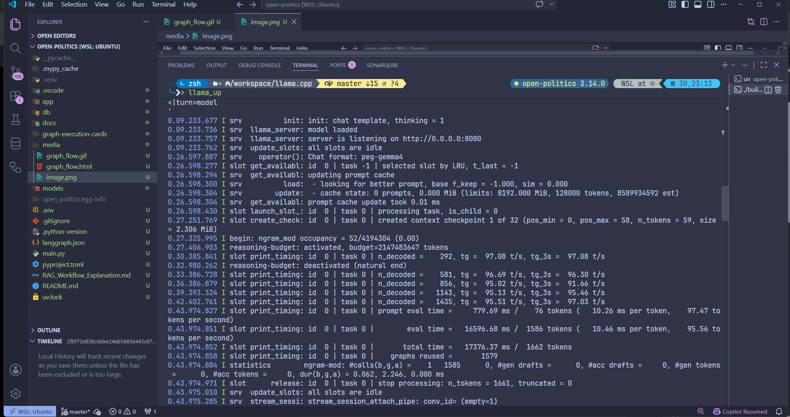
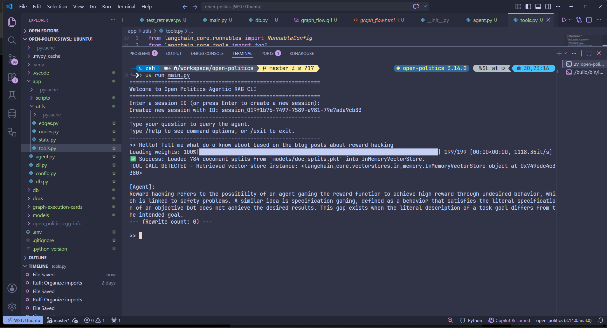
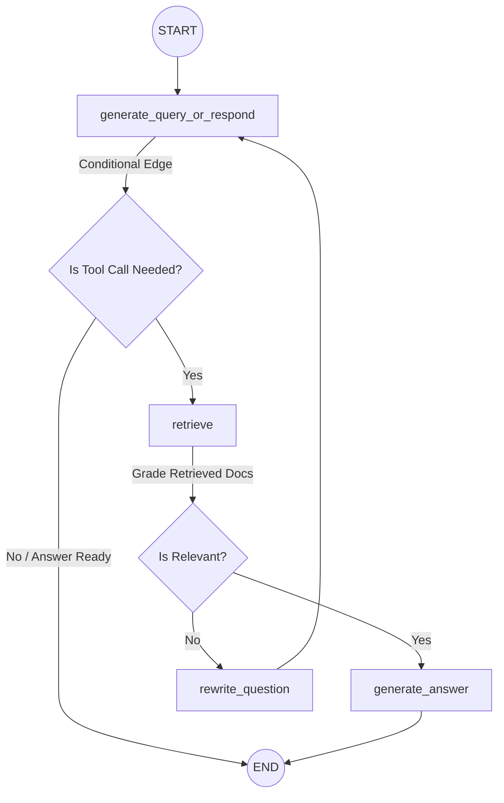

# Open Politics Agentic RAG

[](https://www.python.org/)
[](https://github.com/langchain-ai/langgraph)
[](https://github.com/ggerganov/llama.cpp)
[](https://huggingface.co/sentence-transformers)
[](https://opensource.org/licenses/MIT)

An offline-first, stateful retrieval-augmented generation (RAG) system built with **LangGraph** to analyze and answer queries about complex topics (e.g., technical blogs on reward hacking, hallucinations, and adversarial attacks). 

Unlike traditional linear RAG systems, this project implements a **looping agentic workflow**. It automatically grades document relevance, reformulates search queries dynamically if context is insufficient, and maintains state checkpoint history—enabling session recovery and checkpoint "time travel".

---

## 🌟 Visual Showcase

### 1. Interactive Graph Visualizer
We supply a premium interactive HTML visualizer for the graph flow in [media/graph_flow.html](media/graph_flow.html). 
Open this file in your browser to interactively explore nodes, conditional transitions, state schemas, and execution details.



### 2. Execution Flow Animation
Below is the visual state machine representing the agent's routing process from question to generation.


### 3. Console Execution Details
When running, the agent logs tool calls, grader updates, and question rewrites directly to the console:



---

## ⚙️ Project Architecture & State Loop



### Core Architecture Components
1. **`generate_query_or_respond`**: Analyzes state history and queries the local LLM. If the LLM requests search data, it invokes the retrieval tool.
2. **`retrieve`**: Invokes the `retrieve_blog_posts` tool, querying the local `InMemoryVectorStore` embeddings.
3. **`grade_documents`**: A conditional routing function. Using structured LLM output, it evaluates if retrieved chunks match the user's intent. If relevant, it proceeds to answer generation; otherwise, it routes to query reformulation.
4. **`rewrite_question`**: Formulates a semantically improved search query, increments the rewrite counter, and routes back to the query/response node for retrieval.
5. **`generate_answer`**: Synthesizes a concise final response based *only* on the graded relevant document segments.

---

## 🚀 Setup & Installation

### 1. Prerequisites
- **Python**: `>=3.14`
- **Dependency Manager**: [uv](https://github.com/astral-sh/uv) (highly recommended for rapid installation and running)
- **Local LLM Server**: [llama.cpp](https://github.com/ggerganov/llama.cpp)

### 2. Clone & Install Dependencies
Install all package dependencies in a synced virtual environment:
```bash
# Clone the repository
git clone https://github.com/MigueldsBatista/langgraph-agentic-rag
cd open-politics

# Install dependencies and setup environment
uv venv
uv pip sync
```

### 3. Configure Local Environment
Copy the example environment file and customize it with your configurations (e.g., Hugging Face hub keys):
```bash
cp .env.example .env
```
Ensure your `.env` contains the correct `MODEL_BASE_URL` pointing to your local `llama.cpp` instance.

### 4. Run the Local LLM Server (`llama.cpp`)
You must download a GGUF model (e.g. `unsloth/gemma-4-E4B-it-GGUF`) and serve it on port `8080`:
```bash
# Download and build llama.cpp, then run the server:
./llama-server -m models/gemma-4-E4B-it-Q4_K_M.gguf --port 8080
```

---

## 🛠️ Usage & Verification Scripts

### Ingest and Process Data
Scrapes the target research articles, splits the text into tokens, and caches it locally as a pickle archive (`models/doc_splits.pkl`):
```bash
uv run ingest
```

### Verify Retriever & Embeddings
Verifies the similarity search against the local `Sentence-Transformers` vector store:
```bash
uv run test-retriever
```

### Start the Stateful CLI Session
Launches the interactive CLI loop using Python:
```bash
python main.py
```

---

## 🧭 Interactive CLI Commands

Once you launch the CLI, you can start chat sessions. The graph uses a local SQLite checkpointer (`db/checkpoints.db`) to enable session state history and state rollback ("time travel"):

* **`/help`**: List all available CLI commands.
* **`/history`**: List checkpoints from the current thread (newest to oldest), showing the latest output node and active state indicators.
* **`/travel <checkpoint_id>`**: Instantly roll back the session state to any past checkpoint. When you query the agent next, execution forks and runs from that checkpoint state.
* **`/exit` / `/quit`**: Save your current session state and close the CLI.

---

## 🧹 Project Cleanups and Gitignoring
To prepare the repository for public release, we have performed the following maintenance:
1. **Secrets Security**: Added `.env` to `.gitignore` and provided `.env.example` to protect Hugging Face hub tokens and local credentials.
2. **Local Cache Exclusions**: Ignored local SQLite checkpointer files (`db/*.db`, `*.db-shm`, `*.db-wal`) and sentence-transformers weights (`models/`).
3. **Docs Directory Omission**: The `@docs/` directory has been added to `.gitignore` to keep it out of the public repo, as it contains development blueprints for the next phase of the project.
